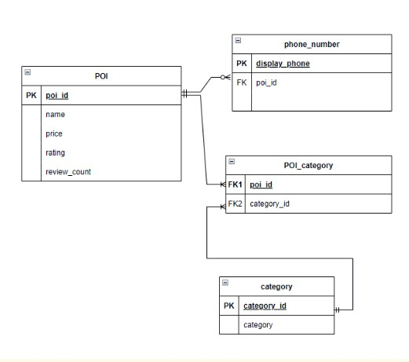

# Miniproject 2

### [Assignment](assignment.md)

## Project/Goals
The main goals of this mini-project were to:
- use the FourSquare and Yelp APIs to collect data on restaurants, bars, and various points of interest (POIs) in the area of my choice
- build a database using the collected data
- compare the quality of the different APIs' coverage of the area

For my project, I decided to collect data on points of interest in the town of Ladysmith, BC, which is a small town near where I live. 

## Process
### Step 1 - Identified Imports
- referred to notes to determine which modules to import and imported them

### Step 2 - Chose Parameters for API calls
- found the latitude and longitude for The Wild Poppy cafe in Ladysmith, BC
- chose a search radius of 1000 meters around The Wild Poppy 

### Step 3 - Made API calls
- for Foursquare: referred to https://developer.foursquare.com/reference/place-search to get the authorization format, url, and query parameters for the API call (already had API_Key saved to environment variables from previous exercises)
- for Yelp: referred to https://www.yelp.com/developers/documentation/v3/authentication to get the API Key, authorization format & 
referred to https://www.yelp.com/developers/documentation/v3/business_search to get the url, query parameters (saved API_Key to environment variables)
- sent the requests through Postman first to test it, and saved the responses to text files [Foursquare Response](/data/response_foursquare_postman) & [Yelp Response](data/response_yelp_postman)
- sent the requests using Python requests module

### Step 4 - Parsed API responses
- used pprint and JSON to view the response and determine which POI details were available

### Step 5 - Put Parsed responses into DataFrames
- used json_normalize to put the parsed results into DataFrames

### Step 6 - Performed Exploratory Data Analysis
- used .shape, .info() and .describe() to understand the size and contents of my dataframes

### Step 7 - Created Entity-Relationship Diagram
- identified key entities (e.g., POI, category, location, phone number) and their attributes, then sketched an and identified the relationships between entities and the cardinality of those relationships 
- I ran out of time to add a location table, but I would have added this as a separate entity and joined it to the poi table.

    

### Step 8 - Created SQLite Database
- sliced original dataframes to create a new dataframe corresponding with each entity (POI, categories, location, phone number, & a POI_category intersection table to join POI and categories, allowing for a many-to-many relationship between POI and category)
- defined a function create_connection() that accepts the path to a SQLite database
- defined a function execute_query() to execute the given query
- created each table and inserted values
- performed [SQL queries](data/queries.sql) to confirm tables were created properly and could be joined on corresponding primary and foreign keys
- one major challenge here was that the categories in the API response were sometimes listed with a leading space and other times not. In order to create a unique list for my category dataframe, I first had to strip those leading spaces.

### Step 9 - Compared Results from FourSquare and Yelp API
- used pandas to describe, sort, and group data to compare the quality of the coverage of the two APIs
- examined number of results, number of attributes for each result, and corresponding insights that can be discovered.

## Results
- Overall, the Yelp API coverage for Ladysmith is more extensive than the FourSquare coverage for the same area, in terms of:
    - DEPTH: The FourSquare API only returned 10 points of interest, whereas the Yelp API returned 20 points of interest in the same search radius (1000m from The Wild Poppy)
    - BREADTH: Yelp provides a wider variety of information for each point of interest. It has 24 items describing each point of interest, including many that are not provided by the FourSquare API (rating, review_count, price informatiom, etc.)
- The greater depth and breadth of data collected from the Yelp API allows for answering questions like:
    - 'What are the top 10 restaurants according to their rating?' Since the Foursquare API didn't including rating information, I wouldn't be able to answer that question with the Foursqare response.
    - 'Which category of restaurant has the best ratings in Ladysmith?' (top 3 are Food Trucks, Vegan, and Mexican restaurants)

## Challenges 
- converting the json object into a dataframe that lists each category individually
- merging dataframes with pandas and understanding when to use inner vs. left joins
- determining how best to construct the SQL entities and creating keys to join those entities
- creating meaningful / appropriate / consistent names

## Future Goals
- add a location table to the SQL database and pull the extra information provided in the FourSquare API response (latitude and longitude)
- perform further analysis and comparison of the dataframes using pandas to answer more questions (e.g., which restaurant has the highest rating at the lowest price?)